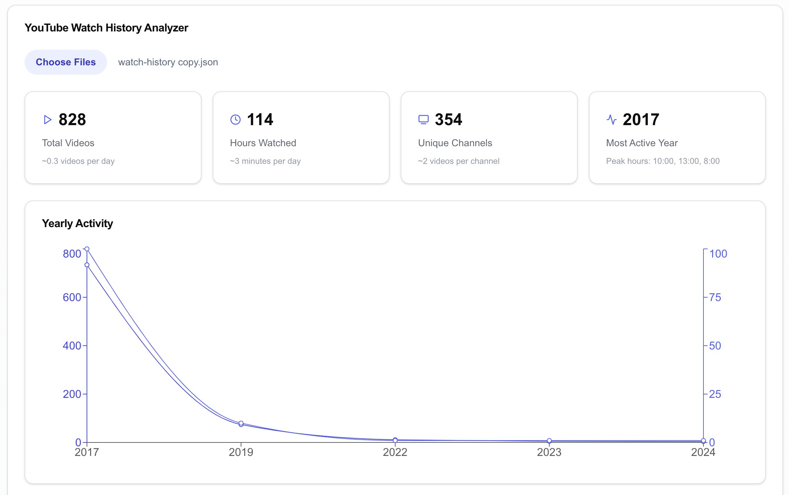

# YouTube Watch History Analyzer

A modern web application that provides detailed analytics and insights from your YouTube watch history. Built with Next.js, TypeScript, and Tailwind CSS.



## Features

- **Comprehensive Analytics**: View your watching patterns, total watch time, and channel statistics
- **Interactive Charts**: Visualize your viewing habits with beautiful, responsive charts
- **Dark Mode Support**: Seamless experience in both light and dark themes
- **Fully Responsive**: Works perfectly on desktop, tablet, and mobile devices
- **Privacy Focused**: All data processing happens locally in your browser

## Getting Started

### Prerequisites

- Node.js 18+
- npm or yarn

### Installation

1. Clone the repository:

```bash
git clone https://github.com/utkubakir/youtube-stats.git
cd youtube-stats
```

2. Install dependencies:

```bash
npm install
```

3. Start the development server:

```bash
npm run dev
```

4. Open [http://localhost:3000](http://localhost:3000) with your browser to see the application.

### How to Use

1. Go to [Google Takeout](https://google.takeout.com)
2. Select only "YouTube and YouTube Music"
3. Choose "History" and deselect all other data
4. Export and download your data
5. Upload the JSON file to the application
6. Explore your YouTube watching patterns!

## Tech Stack

- [Next.js](https://nextjs.org/) - React framework
- [TypeScript](https://www.typescriptlang.org/) - Type safety
- [Tailwind CSS](https://tailwindcss.com/) - Styling
- [Recharts](https://recharts.org/) - Data visualization
- [Shadcn/ui](https://ui.shadcn.com/) - UI components

## Development

### Project Structure

```
youtube-stats/
├── src/
│   ├── app/             # Next.js app router
│   ├── components/      # React components
│   └── styles/          # Global styles
├── public/             # Static assets
└── package.json       # Project dependencies
```

### Available Scripts

- `npm run dev` - Start development server
- `npm run build` - Build for production
- `npm run start` - Start production server
- `npm run lint` - Run ESLint

## Contributing

Contributions are welcome! Please feel free to submit a Pull Request.

## Acknowledgments

- [Next.js](https://nextjs.org/) for the amazing framework
- [Vercel](https://vercel.com/) for hosting
- [Recharts](https://recharts.org/) for the charting library
- [Shadcn/ui](https://ui.shadcn.com/) for the beautiful UI components
